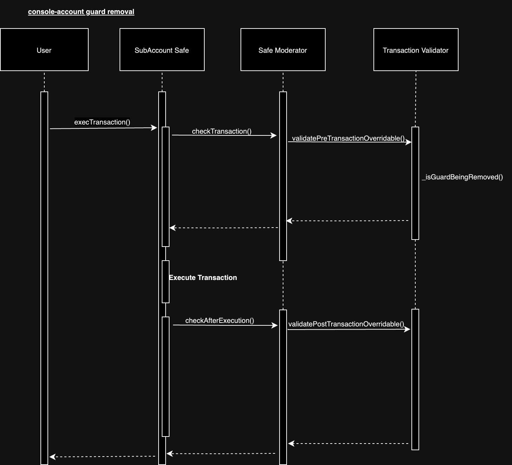

# Architecture and Flows

## ConsoleAccount execTransaction

To make a transaction via `ConsoleAccount`, owner calls `execTransaction()` function. The `execTransaction()` executes in 3 steps

1. `execTransaction()` calls `checkTransaction()` function on `SafeModeratorOverridable`. The `SafeModeratorOverridable` transfers control to `TransactionValidator`. The `TransactionValidator` checks if the guard isn't being removed, it transfers control to PolicySignature by calling `isPolicySignatureValid()` to validate `policyHash` and `Trusted Validator Signature`.
2. Execute the desired calldata.
3. `execTransaction()` calls `checkAfterExecution()` function on `SafeModeratorOverridable`.

Note: Step 1 and 3 are only executed if `SafeModeratorOverridable` is enabled as guard on `ConsoleAccount`, which may not be enabled in the case where `ConsoleAccount` has not setup policy & guard as they are optional.

## Console guard removal transaction

Transaction to reset guard. The `execTransaction()` executes in 3 steps

1. `execTransaction()` calls `checkTransaction()` function on `SafeModeratorOverridable`. The `SafeModeratorOverridable` transfers control to `TransactionValidator`. The `TransactionValidator` checks if the guard is being removed, it returns control back to `ConsoleAccount`.
2. Execute `setGuard(address(0))`.
3. `execTransaction()` calls `checkAfterExecution()` function on `SafeModeratorOverridable`.

Note: Step 1 and 3 are only executed if `SafeModeratorOverridable` is enabled as guard on `ConsoleAccount`, which may not be enabled in the case where `ConsoleAccount` has not setup policy & guard as they are optional.

## SubAccount execTransaction by operator

To make a transaction via `SubAccount`, owner calls `execTransaction()` function. The `execTransaction()` executes in 3 steps

1. `execTransaction()` calls `checkTransaction()` function on `SafeModerator`. The `SafeModerator` validates checks like `policyHash` and `Trusted Validator Signature` using `TransactionValidator` and `PolicyValidator`.
2. Execute the desired calldata.
3. `execTransaction()` calls `checkAfterExecution()` function on `SafeModerator`, that calls `validatePostTransaction()` to check that `SafeModerator` hasn't been removed as guard on `SubAccount` and `ConsoleAccount` hasn't been removed as module on `SubAccount`.

## SubAccount execution via ConsoleAccount

For `ConsoleAccount` to make a transaction via `SubAccount`, `consoleAccount` calls `execTransactionFromModuleReturnData()` function on `SubAccount`. The `execTransactionFromModuleReturnData()` function executes the desired calldata by calling `execute()` function and returns `returnData` to `ConsoleAccount`.

## SubAccount execution via executor plugin

For `Executor` to make a transaction on `SubAccount` via `ExecutorPlugin`. Execution via `ExecutorPlugin` executes in 3 steps;

1. The `Executor` calls `executeTransaction()` function on `ExecutorPlugin` enabled as module on `SubAccount`. The `ExecutorPlugin` validates that signer `Executor` is registered on ExecutorRegistry, then transfers the control to `TransactionValidator` by calling `validatePreExecutorTransaction()` which in turn transfers the control to `PolicyValidator` by calling `isPolicySignatureValid()` to check the `Trusted Validator Signature` is valid and then returns the control back to `ExecutorPlugin` via `TransactionValidator`.
2. `ExecutorPlugin` executes transaction on `SubAccount` as module.
3. After execution of module transaction, the `ExecutorPlugin` calls `validatePostExecutorTransaction()` function on `TransactionValidator`. to check that `SafeModerator` hasn't been removed as guard on `SubAccount` and `ConsoleAccount` hasn't been removed as module on `SubAccount`.

